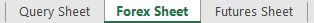
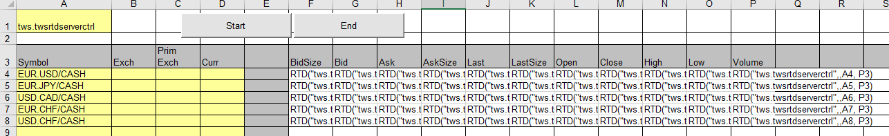
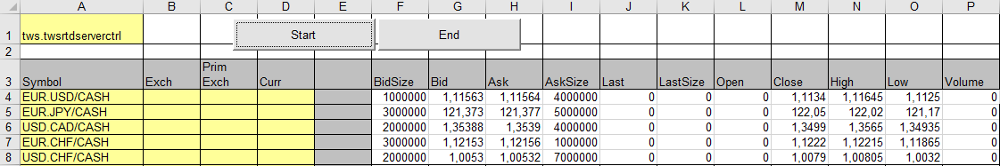

# Real-Time Quotes Ontvangen in Excel

TWS RTD Server API stelt de gebruiker in staat real-time marktdata te ontvangen, vanuit het LYNX
Handelsplatform, in Excel. De TWS RTD Server API maakt direct gebruik van de C# API Client
source, welke via de socket verbinding maakt met het Handelsplatform. De RTD biedt mogelijkheid
live, alsmede 15-minuten vertraagd, data in te zien. Hiertoe wordt gebruikt gemaakt van een speciale
syntax.

> De RTD is nog in ontwikkeling. In de huidige staat is het alleen mogelijk marktdata in te laden
> via RTD. Er bestaat (nog) geen mogelijkheid tot het verzenden van orders of het ontvangen van
> open posities of orders.

Om een verzoek te plaatsen dient er een formule met de onderstaande parameters te worden
aangemaakt in een cel:

`=RTD(**ProgID**, **Server**, **String1**, **String2**, ...)`

waarin

> **ProgID** = "Tws.TwsRtdServerCtrl"
>
> **Server** = "" (leeg)
>
> **String1**, **String2**, ... een opeenvolging van **Ticker**, **Topic**, **Connection Parameters** of andere **Complex Syntax** strings.

## Werken met de LYNX Excel-RTD

### Vereisten:

> - Windows-besturingssysteem
> - Microsoft Excel
> - LYNX API Software Geinstalleerd
> - TWS/LYNX Handelsplatform Open
> - Socket Connection aangevinkt in het Handelsplatform: Configure->API->Settings (Port - 7496 & Enable ActiveX and Socket Clients)

### Opstarten Excel-RTD:

Open de Excel-werkmap 'TwsRtdServer_SimpleSheet.xls' en ga vervolgens naar het Forex gedeelte van de sheet:

U ziet nu de volgende werkmap:

> Door middel van de 'Start' en 'End' knop kunt u beginnen met het opvragen van koersdata voor alle onderliggende waarde in de sheet.

Na het klikken op 'Start' ziet u binnen enkele seconden het volgende verschijnen:

### Meer informatie (Engelstalig):

- [Troubleshooting](https://lynxbroker.github.io/#/RTD_Troubleshooting)
- [Simple Syntax](https://lynxbroker.github.io/#/RTD_Simple_Syntax)
- [Mixed Syntax](https://lynxbroker.github.io/#/RTD_Mixed_Syntax)
- [Complex Syntax](https://lynxbroker.github.io/#/RTD_Complex_Syntax)