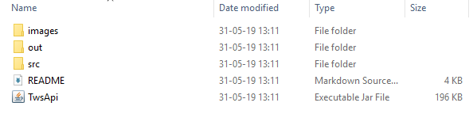
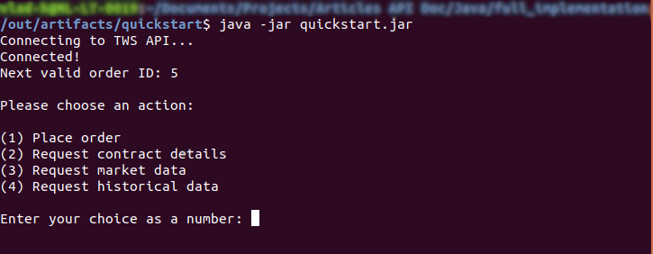

# Java and the <span style="color:green">LYNX API</span>

*A simple Java implementation for (1) placing an order, (2) requesting contract details, (3) requesting market data or (4) requesting historical data for a product from the TWS (Trader Workstation) or the LYNX Gateway*.


## Requirements:

- Java TWS API library (included in the repository or [check the available versions](https://lynxbroker.github.io/#/API_versions))
- TWS running
- Socket Connection enabled and configured in TWS: *Configure->API->Settings* *(Port 7496 & Enable ActiveX and Socket Clients)*
- [Java JDK 8+](https://www.oracle.com/technetwork/java/javase/downloads/index.html)


## Library location

> If you want to manually add the java LYNX API library, the location can be found at ".../TWS_installation_folder/source/JavaClient":


## Content overview


> The *"out/artifacts/quickstart/"* folder contains the **quickstart.jar** application that wraps the whole code into a simple script that you can use to test some of the LYNX API functionalities. The *"src"* folder containing the source files *Main.java & TWSConnection.java* was used to create the *quickstart.jar* file. Finally, there is another *jar* file that represents the TWS API library that needs to be included when creating the API connection.


## Running the *quickstart.jar* application:

> First, make sure you have *java* installed (you can check that by running in the terminal - **java --version**). Then, navigate to "out/artifacts/quickstart/" where the quickstart.jar application is located. Afterwards, open the terminal and type the following: **java -jar quickstart.jar**.



Finally, the program should start running and you will be presented with a menu containing different functionalities that you can test in regard to the LYNX API.


## Editing the code
> If you would like to make changes to the initial program implementation, you can navigate to the *"src"* folder and start editing the source code files (**Main.java** & **TWSConnection.java**). Additionally, you can also explore the separate code examples provided in the [Java](https://github.com/lynxbroker/API-examples/tree/master/Java) repository.


#### Overview of the [TWSConnection.java](https://github.com/lynxbroker/API-examples/blob/master/Java/quickstart/src/TWSConnection.java) class:

> Handles the connection with the API and the incoming messages/requests.
>
> As an example, the following function facilitates the parsing of data in regard to the the price information for products (in the script provided, this can be called using the "(3) Request market data" option). 
>
> - *tickerid* - represents the unique id of the contract/product;
> - *field* - gives the type of the value (e.g.: bid, ask, low, high etc.);
> - *price* - gives the actual value;
> - *tickAttrib* - describes additional information for price ticks (e.g.: canAutoExecute, bidPastLow etc.);
>


```java
...
@Override
public void tickPrice(int tickerId, int field, double price, TickAttrib tickAttrib) {

    //bid
    if (field == 1) {
        System.out.println("Bid price: " + price + " for contract with id " + tickerId);
    }

    //ask
    if (field == 2) {
        System.out.println("Ask price: " + price + " for contract with id " + tickerId);
    }
}
...
```


#### Overview of the [Main.java](https://github.com/lynxbroker/API-examples/blob/master/Java/quickstart/src/Main.java) class:

> The main class where the API calls are made from & the connection to the API is established. Once the connection to the API is created through the TWSConnection class object, different types of requests can be created. Check the [examples](https://github.com/lynxbroker/API-examples/tree/master/Java) provided.


```java
// Copyright (C) 2019 LYNX B.V. All rights reserved.
import com.ib.client.Contract;

public class Main {

    public static void main(String[] args){
        // Init twsConnection Object, see TWSConnection.java file
        TWSConnection twsConnection = new TWSConnection();
        twsConnection.makeConnection();
        
        // Example of an API call for requesting contract details
        twsConnection.client.reqContractDetails(example_id, example_contract);
    }
}
```

