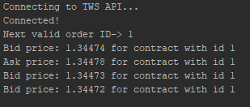

## Java and the LYNX API

*A simple Java implementation for requesting streaming market data or placing an order for a product from the TWS (Trader Workstation) or the LYNX Gateway.*

### Requirements:

- Java TWS API library (included in the repository or [check available versions](https://api.lynx.academy/API_versions))
- TWS running
- Socket Connection enabled and configured: *Configure->API->Settings* *(Port 7496 & Enable ActiveX and Socket Clients)*
- [Java JDK 8+](https://www.oracle.com/technetwork/java/javase/downloads/index.html)


### Library location

> If you want to manually add the java LYNX API library, the location can be found at ".../TWS_installation_folder/source/JavaClient":

<p align="center">
  
</p>


### The [TWSConnection.java](https://github.com/lynxbroker/API-examples/blob/master/Java/request_market_data/src/TWSConnection.java) class:

> Handles the connection and the incoming messages/requests.
>
> As an example, the following function facilitates the parsing of the price information for the products. The *"field"* parameter gives the type of the value (e.g.: bid, ask, low, high etc.) in relation with the *"tickerId"* (unique for each contract).

```java
...
@Override
public void tickPrice(int tickerId, int field, double price, TickAttrib tickAttrib) {

    //bid
    if (field == 1) {
        System.out.println("Bid price: " + price + " for contract with id " + tickerId);
    }

    //ask
    if (field == 2) {
        System.out.println("Ask price: " + price + " for contract with id " + tickerId);
    }
}
...
```


### The [Main.java](https://github.com/lynxbroker/API-examples/blob/master/Java/request_market_data/src/Main.java) class:

> The place where the API calls are made from & the connection to the API is established. Once the connection to the API is created through the TWSConnection class object, different types of requests can be made. Below, some examples are provided.


#### Requesting market data:

```java
// Copyright (C) 2019 LYNX B.V. All rights reserved.
import com.ib.client.Contract;

public class Main {

    public static void main(String[] args){
        // Init twsConnection Object, see TWSConnection.java file
        TWSConnection twsConnection = new TWSConnection();
        twsConnection.makeConnection();

        // Define Contract details
        Contract example_contract = new Contract();
        example_contract.localSymbol("USD.CAD");
        example_contract.secType("CASH");
        example_contract.currency("CAD");
        example_contract.exchange("IDEALPRO");

        // Request Market Data for Contract details
        TWSConnection.INSTANCE.client.reqMktData(1, example_contract, "", false, false, null);
    }
}
```

>  It initiates a **TWSConnection** object that is used to create the connection with the LYNX API. Moreover, a *Contract* is defined (in our example the USD/CAD FOREX pair) and sent together as a market data request to the API. Thus, the incoming data will be transmitted to the corresponding function in the **TWSConnection class** - [*tickPrice()*](https://api.lynx.academy/EWrapper?id=tickprice).


<p align="center">
  
</p>
