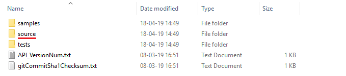

# Python & the LYNX API 

Code samples that show some of the LYNX API possible implementations.

### Table of contents
- [**place_order**](https://github.com/lynxbroker/API-examples/tree/master/Python/place_order) - code example of placing an order though the API
- [**request_contract_details**](https://github.com/lynxbroker/API-examples/tree/master/Python/request_contract_details) - code example of requesting contract details for a product through the API
- [**request_historical_data**](https://github.com/lynxbroker/API-examples/tree/master/Python/request_historical_data) - code example of requesting historical data for a product through the API
- [**request_market_data**](https://github.com/lynxbroker/API-examples/tree/master/Python/request_market_data) - code example of requesting realtime ticks for a product through the API

---
##### Also, for more information visit our [API Documentation](https://lynxbroker.github.io/).
---

  

# Setting up your environment to work with the LYNX API and Python

**Requirements**:

- [API Software](https://lynxbroker.github.io/documentation/#/API_versions) Installed
- TWS Running
- Socket Connection enabled and configured: *Configure->API->Settings* *(Port - 7496 & Enable ActiveX and Socket Clients)*
- Python 3.6 or higher

**Installation:**

> After the API software has been downloaded and installed, the folder should have the following contents:

> In order to include the API library in the global site-packages you must navigate to *".../TWS_installation_folder/source/pythonclient"*:

> Finally, run the python script *setup.py* in a console with the following command - *python setup.py install* :

