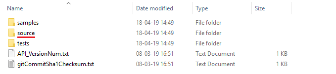
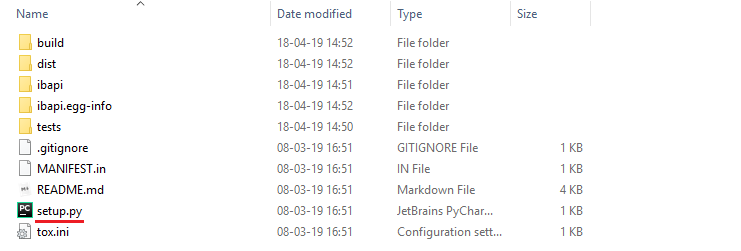
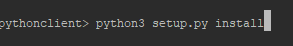

# Setting up your environment to work with the LYNX API and Python

**Requirements**:

- [API Software](https://api.lynx.academy/API_versions) Installed
- TWS Running
- Socket Connection enabled and configured: *Configure->API->Settings* *(Port - 7496 & Enable ActiveX and Socket Clients)*
- Python 3.6 or higher

**Installation:**

> After the API software has been downloaded and installed, the folder should have the following contents:

> In order to include the API library in the global site-packages you must navigate to *".../TWS_installation_folder/source/pythonclient"*:

> Finally, run the python script *setup.py* in a console with the following command - *python setup.py install* :

