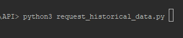
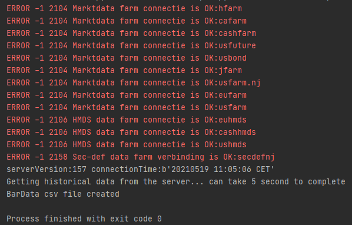
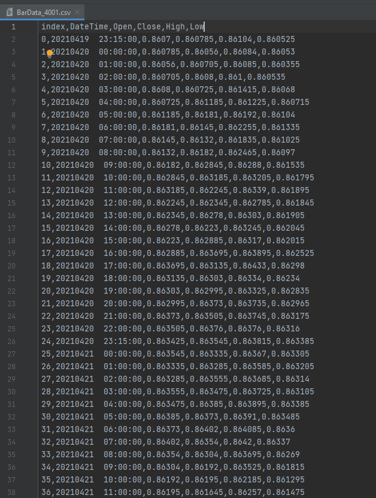

# Python and the LYNX API

*A simple Python implementation for requesting Historical Bardata from Trader Workstation or the LYNX Gateway*

## Requirements:

> - [API Software](https://api.lynx.academy/API_versions) Installed
>- TWS Running
> - Socket Connection enabled and configured: *Configure->API->Settings* *(Port - 7496 & Enable ActiveX and Socket Clients)*
> - Python 3.6 or higher
> - Set-up your environment to work with the API as described [here](/Python/SETUP.md)
> 


At the bottom you will find the full example to request Historical Data using the LYNX API, or download the .py file directly [here](Python/request_historical_data/request_historical_data.py). 

## Initial Setup

**EWrapper and EClient:**

```python
# Copyright (C) 2021 LYNX B.V. All rights reserved.

# Import ibapi deps
from ibapi.client import EClient
from ibapi.wrapper import EWrapper
from ibapi.contract import *

import threading
from datetime import datetime
from time import sleep


class App(EWrapper, EClient):
    def __init__(self, ipaddress, portid, clientid):
        EClient.__init__(self, self)

        self.connect(ipaddress, portid, clientid)
        app_thread = threading.Thread(target=self.run)  # run the socket in a thread
        app_thread.start()

```

The two most import source code files in the pythonclient folder are EClient and EWrapper. The EWrapper is necessary to receive and handle the information coming from TWS and the ECLient is used to send outgoing request/messages to TWS. In order to redirect the output from the EWrapper to a specific place a function from it needs to be overwritten in the script. 

In a newly created App class, both the EClient and the EWrapper class are passed through into it and a thread is added.

*Note: consult the EWrapper/EClient source files if you are not sure which functions to use.*

---

## Receiving Historical Bardata from the LYNX API:

In order to start receiving data we need to perform seven actions:

1. Initialize the App class and create a connection
2. Define the contract to request
3. Initialize a data variable   
4. Call the actual request
5. Overwrite the correct function from the EWrapper class
6. Create a dataframe and covert to a CSV file
7. Disconnect the connection

**The App class:**

```python
# Init the TestApp(Wrapper, Client)
app = App("localhost", 7496, clientid = 0)
print("serverVersion:%s connectionTime:%s" % (app.serverVersion(),
                                              app.twsConnectionTime()))
```

**The contract definition:**

```python
# Define the contract
contract = Contract()
contract.symbol = "EUR"
contract.secType = "CASH"
contract.currency = "GBP"
contract.exchange = "IDEALPRO"
```

**Variable for data**

```python
self.data = []  # initialize variable to store data in
```

**The Request**:

```python
# Define the end date of the query. If left empty, the current date/time is taken as the end date.
queryTime = (datetime.today() - timedelta(days=0)).strftime("%Y%m%d %H:%M:%S")  

# Here we are requesting historical bar data for the the EUR.USD contract
app.reqHistoricalData(reqId, contract, queryTime,
                       duration, barSize, "MIDPOINT", 1, 1, False, [])
```

**Returning the Request:**

```python
def historicalData(self, reqId: int, bar: BarData):
    # append the bardata in the data variable
    self.data.append([bar.date, bar.open, bar.close, bar.high, bar.low])
```

**CSV File:**

```python
# Create a CSV file of the historical data
df = pd.DataFrame(app.data, columns=['DateTime','Open', 'Close', 'High', 'Low'])
df.to_csv("BarData_{}.csv".format(reqId), index_label='index')
print("BarData csv file created")
```

**Diconnect**
```python
# The connection can be disconnected after the data has been received
app.disconnect()
```

---

### The entire code:
```python
# Copyright (C) 2021 LYNX B.V. All rights reserved.

# Import ibapi deps
from ibapi.client import EClient
from ibapi.wrapper import EWrapper
from ibapi.contract import *
from ibapi.common import BarData

import threading
from datetime import datetime
from datetime import timedelta
from time import sleep
import pandas as pd


class App(EWrapper, EClient):
    def __init__(self, ipaddress, portid, clientid):
        EClient.__init__(self, self)
        self.data = []  # initialize variable to store data in

        self.connect(ipaddress, portid, clientid)
        app_thread = threading.Thread(target=self.run)  # run the socket in a thread
        app_thread.start()

    def historicalData(self, reqId: int, bar: BarData):
        """ returns the requested historical data bars

        reqId - the request's identifier
        date  - the bar's date and time (either as a yyyymmss hh:mm:ssformatted
             string or as system time according to the request)
        open  - the bar's open point
        high  - the bar's high point
        low   - the bar's low point
        close - the bar's closing point
        volume - the bar's traded volume if available
        count - the number of trades during the bar's timespan (only available
            for TRADES).
        WAP -   the bar's Weighted Average Price
        hasGaps  -indicates if the data has gaps or not. """

        # append the bardata in the data variable
        self.data.append([bar.date, bar.open, bar.close, bar.high, bar.low])


def main():
    app = App("localhost", 7496, clientid = 0)
    print("serverVersion:%s connectionTime:%s" % (app.serverVersion(),
                                                  app.twsConnectionTime()))

    # Define the contract
    contract = Contract()
    contract.symbol = "EUR"
    contract.secType = "CASH"
    contract.currency = "GBP"
    contract.exchange = "IDEALPRO"

    # Define the end date of the query. If left empty, the current date/time is taken as the end date.
    queryTime = (datetime.today() - timedelta(days=0)).strftime("%Y%m%d %H:%M:%S")

    # Here we are requesting historical bar data for the the EUR.GBP contract
    reqId = 4001
    app.reqHistoricalData(reqId, contract, queryTime, "1 M", "1 hour", "MIDPOINT", 1, 1, False, [])

    MAX_WAITED_SECONDS = 5
    print("Getting historical data from the server... can take %d second to complete" % MAX_WAITED_SECONDS)

    sleep(MAX_WAITED_SECONDS)

    # Create a CSV file of the historical data
    df = pd.DataFrame(app.data, columns=['DateTime','Open', 'Close', 'High', 'Low'])
    df.to_csv("BarData_{}.csv".format(reqId), index_label='index')
    print("BarData csv file created")

    # The connection can be disconnected after the data has been received
    app.disconnect()


if __name__ == "__main__":
    main()
```

## More information:

**Running the program:**

> After installing the necessary files you should be able to run *request_historical_data.py* from you IDE or from your terminal using:

```bash
python3 request_historical_data.py
```



> After which the following response indicates a successful connection:




> After which a CSV file with the requested data will be created in your directory:



---

### More resources:

Take a further look at our online API Documentation to discover all of the possibilities using LYNX' API.

- [LYNX Basic Contract Definitions](https://api.lynx.academy/BasicContracts)
- [LYNX Requesting Historical Data](https://api.lynx.academy/HistoricalBarData)

<br/>

<p align="center">
  
</p>


