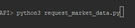
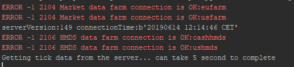
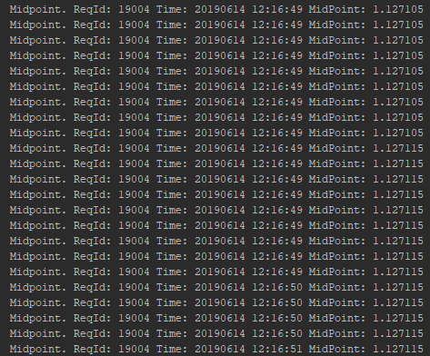

# Python and the LYNX API

*A simple Python implementation for requesting streaming Market Data from Trader Workstation or the LYNX Gateway*

## Requirements:

> - [API Software](https://api.lynx.academy/API_versions) Installed
>- TWS Running
> - Socket Connection enabled and configured: *Configure->API->Settings* *(Port - 7496 & Enable ActiveX and Socket Clients)*
> - Python 3.6 or higher
> - Set-up your environment to work with the API as described [here](/Python/SETUP.md)
> 


At the bottom you will find the full example to request Market Data using the LYNX API, or download the .py file directly [here](/Python/request_market_data/request_market_data.py). 

## Initial Setup

**EWrapper and EClient:**

```python
# Copyright (C) 2021 LYNX B.V. All rights reserved.

# Import ibapi deps
from ibapi.client import EClient
from ibapi.wrapper import EWrapper
from ibapi.contract import *

import threading
from datetime import datetime
from time import sleep


class App(EWrapper, EClient):
    def __init__(self, ipaddress, portid, clientid):
        EClient.__init__(self, self)
        self.data = [] #initialize variable to store data in

        self.connect(ipaddress, portid, clientid)
        app_thread = threading.Thread(target=self.run)  # run the socket in a thread
        app_thread.start()

```

The two most import source code files in the pythonclient folder are EClient and EWrapper. The EWrapper is necessary to receive and handle the information coming from TWS and the ECLient is used to send outgoing request/messages to TWS. In order to redirect the output from the EWrapper to a specific place a function from it needs to be overwritten in the script. 

In a newly created App class, both the EClient and the EWrapper class are passed through into it and a thread is added.

*Note: consult the EWrapper/EClient source files if you are not sure which functions to use.*

---

## Receiving Real-Time, Streaming, Quotes from the LYNX API:

In order to start receiving data we need to perform five actions:

1. Initialize the App class and create a connection
2. Define the contract to request
3. Call the actual request
4. Overwrite the correct function from the EWrapper class
5. Disconnect the connection

**The App class:**

```python
# Init the TestApp(Wrapper, Client)
app = App("localhost", 7496, clientid = 0)
print("serverVersion:%s connectionTime:%s" % (app.serverVersion(),
                                              app.twsConnectionTime()))
```

**The contract definition:**

```python
# Define the contract
contract = Contract()
contract.symbol = "EUR"
contract.secType = "CASH"
contract.currency = "USD"
contract.exchange = "IDEALPRO"
```

**The Request**:

```python
# Here we are requesting tickdata for the EUR.USD Contract.
app.reqTickByTickData(4001, contract, "MidPoint", 0, False)
```

**Returning the Request:**

```python
# Here we print the Midpoint, Request ID and Time using a function from the EWrapper class
def tickByTickMidPoint(self, reqId: int, time: int, midPoint: float):
        print("Midpoint. ReqId:", reqId,
              "Time:", datetime.datetime.fromtimestamp(time).strftime("%Y%m%d %H:%M:%S"),
              "MidPoint:", midPoint)   
```

**Diconnect**
```python
# The connection can be disconnected after the data has been received
app.disconnect()
```
---

### The entire code:


```python
# Copyright (C) 2021 LYNX B.V. All rights reserved.

# Import ibapi deps
from ibapi.client import EClient
from ibapi.wrapper import EWrapper
from ibapi.contract import *

import threading
from datetime import datetime
from time import sleep


class App(EWrapper, EClient):
    def __init__(self, ipaddress, portid, clientid):
        EClient.__init__(self, self)

        self.connect(ipaddress, portid, clientid)
        app_thread = threading.Thread(target=self.run)  # run the socket in a thread
        app_thread.start()

    def tickByTickMidPoint(self, reqId: int, time: int, midPoint: float):
        """returns tick-by-tick data for tickType = "MidPoint" """

        print("Midpoint. ReqId:", reqId,
              "Time:", datetime.fromtimestamp(time).strftime("%Y%m%d %H:%M:%S"),
              "MidPoint:", midPoint)


def main():
    # Init the App(Wrapper, Client)
    app = App("localhost", 7497, clientid=0)
    print("serverVersion:%s connectionTime:%s" % (app.serverVersion(),
                                                  app.twsConnectionTime()))

    # Define the contract
    contract = Contract()
    contract.symbol = "EUR"
    contract.secType = "CASH"
    contract.currency = "USD"
    contract.exchange = "IDEALPRO"

    # Here we are requesting tickdata for the EUR.USD Contract.
    app.reqTickByTickData(4001, contract, "MidPoint", 0, False)

    MAX_WAITED_SECONDS = 5
    print("Getting tick data from the server... can take %d second to complete" % MAX_WAITED_SECONDS)

    sleep(MAX_WAITED_SECONDS)

    # The connection can be disconnected after the data has been received
    app.disconnect()

if __name__ == "__main__":
    main()

```


## More information:

**Running the program:**


> After installing the necessary files you should be able to run *request_market_data.py* from you IDE or from your terminal using:

```bash
python3 request_market_data.py
```



> After which the following response indicates a successful connection:




> After which a stream of data should start generating:



---

### More resources:

Take a further look at our online API Documentation to discover all of the possibilities using LYNX' API.

- [LYNX Basic Contract Definitions](https://api.lynx.academy/BasicContracts)
- [LYNX Requesting Market Data](https://api.lynx.academy/TopMarketData)
- [LYNX Available TickTypes](https://api.lynx.academy/TickTypes)
<br/>

<p align="center">
  
</p>
