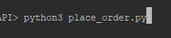
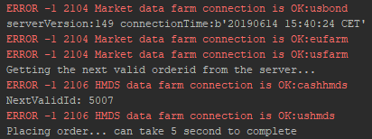
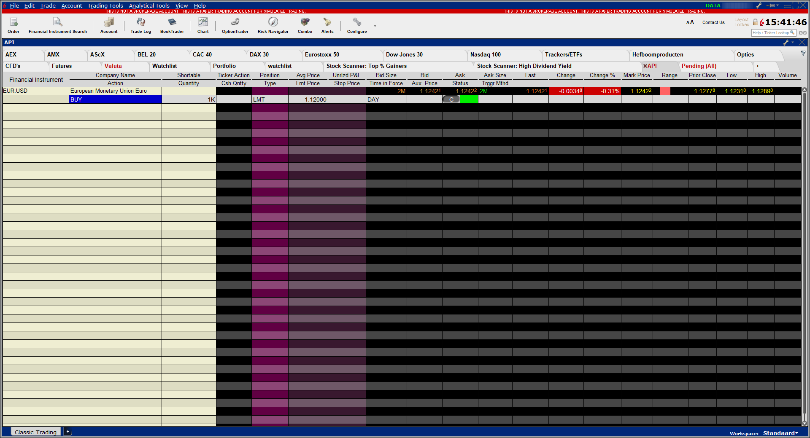

# Python and the LYNX API

*A simple Python implementation for placing an order from Trader Workstation or the LYNX Gateway*

## Requirements:

> - [API Software](https://lynxbroker.github.io/#/API_versions) Installed
>- TWS Running
> - Socket Connection enabled and configured: *Configure->API->Settings* *(Port - 7496 & Enable ActiveX and Socket Clients)*
> - Python 3.6 or higher
> - Set-up your environment to work with the API as described [here](/Python/README.md)
> 


At the bottom you will find the full example to place an order using the LYNX API, or download the .py file directly [here](/request_contract_details.py). 

## Initial Setup

**EWrapper and EClient:**

```python
# Copyright (C) 2019 LYNX B.V. All rights reserved.

# Import ibapi deps
from ibapi import wrapper
from ibapi.client import EClient
from ibapi.contract import *
from ibapi.order import *
from threading import Thread

from time import sleep

class Wrapper(wrapper.EWrapper):
    def __init__(self):
        wrapper.EWrapper.__init__(self)

class Client(EClient):
    def __init__(self, wrapper):
        EClient.__init__(self, wrapper)
        
class TestApp(Wrapper, Client):
    def __init__(self, ipaddress, portid, clientid):
        Wrapper.__init__(self)
        Client.__init__(self, wrapper=self)

        self.connect(ipaddress, portid, clientid)

        thread = Thread(target=self.run)
        thread.start()

        setattr(self, "_thread", thread)

```

> Once TWS is actively listening for an incoming connection, the two main objects (EWrapper and ESocketClient) can be created. The EWrapper is necessary to receive and handle the information coming from the TWS and The ESocketCLient is used to send request/messages to the TWS. Placing them together in de TestApp class and adding a thread starts a process to listen for incoming messages and insert them in the Ewrapper. 

---

## Placing an order from the LYNX API:

In order to start placing an order we need to perform five actions:

1. Define the contract to request
2. Define the order to request
3. Return the next valid order id
4. Define the actual request
5. Call the function that includes the request in the main

**The contract definition:**

```python
# Define the contract
contract = Contract()
contract.symbol = "EUR"
contract.secType = "CASH"
contract.currency = "USD"
contract.exchange = "IDEALPRO"
```

**The order definition:**

```python
#define the order to place
order = Order()
order.action = "BUY"
order.orderType = "LMT"
order.totalQuantity = 1000
order.lmtPrice = 1.12
```

**Return next valid order id:**

```python
# Here we return the next valid order from the Ewrapper to a global variable
def nextValidId(self, orderId: int):
    super().nextValidId(orderId)
    self.nextValidOrderId = orderId
    print("NextValidId:", orderId)

    global nextValidOrderId
    nextValidOrderId = orderId
```

**The Request**:

```python
# Here we are placing the request for the order
self.placeOrder(self.nextValidOrderId, contract, order)
```

**The main function:**

```python
# Init the TestApp(Wrapper, Client)
app = TestApp("localhost", 7496, clientid = 0)
print("serverVersion:%s connectionTime:%s" % (app.serverVersion(),
                                              app.twsConnectionTime()))

# Here we call the function that includes the request for the order                                          
app.place_order(contract, order)

```
                                             
---

### The entire code:
```python
"""
Copyright (C) 2019 LYNX B.V. All rights reserved.
"""

# Import ibapi deps
from ibapi import wrapper
from ibapi.client import EClient
from ibapi.contract import *
from ibapi.order import *
from threading import Thread

from time import sleep

nextValidOrderId = 0

class Wrapper(wrapper.EWrapper):
    def __init__(self):
        wrapper.EWrapper.__init__(self)

    def nextValidId(self, orderId: int):
        """ Receives next valid order id."""
        super().nextValidId(orderId)

        self.nextValidOrderId = orderId
        print("NextValidId:", orderId)

        global nextValidOrderId

        nextValidOrderId = orderId

class Client(EClient):
    def __init__(self, wrapper):
        EClient.__init__(self, wrapper)

    def place_order(self, contract, order):
        MAX_WAITED_SECONDS = 5

        global nextValidOrderId

        print("Getting the next valid orderid from the server...")
        sleep(MAX_WAITED_SECONDS)

        # Here we are placing the request for the order
        self.placeOrder(nextValidOrderId, contract, order)

        print("Placing order... can take %d second to complete" % MAX_WAITED_SECONDS)
        sleep(MAX_WAITED_SECONDS)


class TestApp(Wrapper, Client):
    def __init__(self, ipaddress, portid, clientid):
        Wrapper.__init__(self)
        Client.__init__(self, wrapper=self)

        self.connect(ipaddress, portid, clientid)

        thread = Thread(target=self.run)
        thread.start()

        setattr(self, "_thread", thread)


def main():
    # Init the TestApp(Wrapper, Client)
    app = TestApp("localhost", 7496, clientid = 0)
    print("serverVersion:%s connectionTime:%s" % (app.serverVersion(),
                                                  app.twsConnectionTime()))

    # Define the contract
    contract = Contract()
    contract.symbol = "EUR"
    contract.secType = "CASH"
    contract.currency = "USD"
    contract.exchange = "IDEALPRO"

    # Define the order to place
    order = Order()
    order.action = "BUY"
    order.orderType = "LMT"
    order.totalQuantity = 1000
    order.lmtPrice = 1.12

    app.place_order(contract, order)

if __name__ == "__main__":
    main()

```

## More information:

**Running the program:**

> After installing the necessary files you should be able to run *place_order.py* from you IDE or from your terminal using:

```bash
python3 place_order.py
```



> After which the following response indicates a successful connection:




> In your trading platform the corresponding order will be active as shown in the image below:



---

### More resources:

Take a further look at our online API Documentation to discover all of the possibilities using LYNX' API.

- [LYNX Basic Contract Definitions](https://api.lynx.academy/#/BasicContracts.md)
- [LYNX Basic Order Definitions](https://api.lynx.academy/#/BasicOrders.md)
- [LYNX Order Management](https://api.lynx.academy/#/OrderManagement.md)

<br/>

<p align="center">
  
</p>
