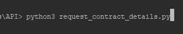
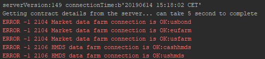
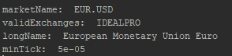

# Python and the LYNX API

*A simple Python implementation for requesting Contract Details from Trader Workstation or the LYNX Gateway*

## Requirements:

> - [API Software](https://lynxbroker.github.io/#/API_versions) Installed
>- TWS Running
> - Socket Connection enabled and configured: *Configure->API->Settings* *(Port - 7496 & Enable ActiveX and Socket Clients)*
> - Python 3.6 or higher
> - Set-up your environment to work with the API as described [here](/articles/Python/README.md)
> 


At the bottom you will find the full example to request Contract Details using the LYNX API, or download the .py file directly [here](/request_contract_details.py). 

## Initial Setup

**EWrapper and EClient:**

```python
# Copyright (C) 2019 LYNX B.V. All rights reserved.

# Import ibapi deps
from ibapi import wrapper
from ibapi.client import EClient
from ibapi.contract import *
from threading import Thread

from time import sleep

class Wrapper(wrapper.EWrapper):
    def __init__(self):
        wrapper.EWrapper.__init__(self)

class Client(EClient):
    def __init__(self, wrapper):
        EClient.__init__(self, wrapper)
        
class TestApp(Wrapper, Client):
    def __init__(self, ipaddress, portid, clientid):
        Wrapper.__init__(self)
        Client.__init__(self, wrapper=self)

        self.connect(ipaddress, portid, clientid)

        thread = Thread(target=self.run)
        thread.start()

        setattr(self, "_thread", thread)

```

> Once TWS is actively listening for an incoming connection, the two main objects (EWrapper and ESocketClient) can be created. The EWrapper is necessary to receive and handle the information coming from the TWS and The ESocketCLient is used to send request/messages to the TWS. Placing them together in de TestApp class and adding a thread starts a process to listen for incoming messages and insert them in the Ewrapper. 

---

## Receiving Contract Details from the LYNX API:

In order to start receiving the contract details we need to perform four actions:

1. Define the contract to request
2. Define the actual request
3. Print the return from the request
3. Call the function that includes the request in the main

**The contract definition:**

```python
# Define the contract
contract = Contract()
contract.symbol = "EUR"
contract.secType = "CASH"
contract.currency = "USD"
contract.exchange = "IDEALPRO"
```

**The Request**:

```python
# Here we are requesting contract details for the EUR.USD Contract
self.reqContractDetails(reqId, contract)
```

**Returning the Request:**

```python
# Here we print the details returned by the Ewrapper 
def historicalData(self, reqId:int, bar: BarData):
    def contractDetails(self, reqId:int, contractDetails:ContractDetails):
        super().contractDetails(reqId, contractDetails)
        print("marketName: ", contractDetails.marketName, "\nvalidExchanges: ", contractDetails.validExchanges,\
              "\nlongName: ", contractDetails.longName, "\nminTick: ",contractDetails.minTick)
        #printinstance(contractDetails) using this print statement all of the availabe details will be printed out.
```

**The main function:**

```python
# Init the TestApp(Wrapper, Client)
app = TestApp("localhost", 7496, clientid = 0)
print("serverVersion:%s connectionTime:%s" % (app.serverVersion(),
                                              app.twsConnectionTime()))

# Here we call the function that includes the request for contract details                                            
app.get_contractDetails(contract)

```
                                             
---

### The entire code:
```python
"""
Copyright (C) 2019 LYNX B.V. All rights reserved.
"""

# Import ibapi deps
from ibapi import wrapper
from ibapi.client import EClient
from ibapi.contract import *
from threading import Thread

from time import sleep

CONTRACT_ID = 4001

class Wrapper(wrapper.EWrapper):
    def __init__(self):
        wrapper.EWrapper.__init__(self)

    def contractDetails(self, reqId:int, contractDetails:ContractDetails):
        """Receives the full contract's definitions. This method will return all
        contracts matching the requested via EEClientSocket::reqContractDetails.
        For example, one can obtain the whole option chain with it."""

        super().contractDetails(reqId, contractDetails)
        print("marketName: ", contractDetails.marketName, "\nvalidExchanges: ", contractDetails.validExchanges,\
              "\nlongName: ", contractDetails.longName, "\nminTick: ",contractDetails.minTick)
        #printinstance(contractDetails) using this print statement all of the availabe details will be printed out.


class Client(EClient):
    def __init__(self, wrapper):
        EClient.__init__(self, wrapper)

    def get_contractDetails(self, contract, reqId = CONTRACT_ID):

        # Here we are requesting contract details for the EUR.USD Contract
        self.reqContractDetails(reqId, contract)

        MAX_WAITED_SECONDS = 5
        print("Getting contract details from the server... can take %d second to complete" % MAX_WAITED_SECONDS)

        sleep(MAX_WAITED_SECONDS)

class TestApp(Wrapper, Client):
    def __init__(self, ipaddress, portid, clientid):
        Wrapper.__init__(self)
        Client.__init__(self, wrapper=self)

        self.connect(ipaddress, portid, clientid)

        thread = Thread(target=self.run)
        thread.start()

        setattr(self, "_thread", thread)

def printinstance(inst:Object):
    attrs = vars(inst)
    print('\n'.join("%s: %s" % item for item in attrs.items()))

def main():
    # Init the TestApp(Wrapper, Client)
    app = TestApp("localhost", 7496, clientid = 0)
    print("serverVersion:%s connectionTime:%s" % (app.serverVersion(),
                                                  app.twsConnectionTime()))

    # Define the contract
    contract = Contract()
    contract.symbol = "EUR"
    contract.secType = "CASH"
    contract.currency = "USD"
    contract.exchange = "IDEALPRO"

    app.get_contractDetails(contract)

if __name__ == "__main__":
    main()

```

## More information:

**Running the program:**

> After installing the necessary files you should be able to run *request_contract_details.py* from you IDE or from your terminal using:

```bash
python3 request_contract_details.py
```



> After which the following response indicates a successful connection:




> After which the requested contract details will be shown:



---

### More resources:

Take a further look at our online API Documentation to discover all of the possibilities using LYNX' API.

- [LYNX Basic Contract Definitions](https://lynxbroker.github.io/#/BasicContracts.md)
- [LYNX Requesting Contract Details](https://lynxbroker.github.io/#/RequestingContractDetails.md)

<br/>

<p align="center">
  
</p>

