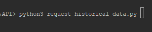
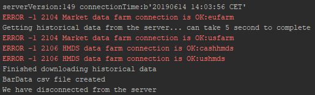
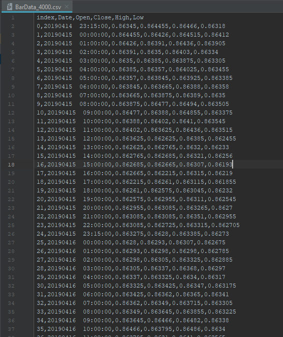

# Python and the LYNX API

*A simple Python implementation for requesting Historical Bardata from Trader Workstation or the LYNX Gateway*

## Requirements:

> - [API Software](https://api.lynx.academy/#/API_versions) Installed
>- TWS Running
> - Socket Connection enabled and configured: *Configure->API->Settings* *(Port - 7496 & Enable ActiveX and Socket Clients)*
> - Python 3.6 or higher
> - Set-up your environment to work with the API as described [here](/Python/README.md)
> 


At the bottom you will find the full example to request Historical Data using the LYNX API, or download the .py file directly [here](/request_historical_data.py). 

## Initial Setup

**EWrapper and EClient:**

```python
# Copyright (C) 2019 LYNX B.V. All rights reserved.

# Import ibapi deps
from ibapi import wrapper
from ibapi.client import EClient
from ibapi.common import *
from ibapi.contract import *
from threading import Thread

from datetime import datetime
from datetime import timedelta
from time import sleep

import pandas as pd

class Wrapper(wrapper.EWrapper):
    def __init__(self):
        wrapper.EWrapper.__init__(self)

class Client(EClient):
    def __init__(self, wrapper):
        EClient.__init__(self, wrapper)
        
class TestApp(Wrapper, Client):
    def __init__(self, ipaddress, portid, clientid):
        Wrapper.__init__(self)
        Client.__init__(self, wrapper=self)

        self.connect(ipaddress, portid, clientid)

        thread = Thread(target=self.run)
        thread.start()

        setattr(self, "_thread", thread)

```

> Once TWS is actively listening for an incoming connection, the two main objects (EWrapper and ESocketClient) can be created. The EWrapper is necessary to receive and handle the information coming from the TWS and The ESocketCLient is used to send request/messages to the TWS. Placing them together in de TestApp class and adding a thread starts a process to listen for incoming messages and insert them in the Ewrapper. 

---

## Receiving Historical Bardata from the LYNX API:

In order to start receiving data we need to perform four actions:

1. Define the contract to request
2. Define the actual request
3. Create a global dataframe and return the data from the request
4. Call the function that includes the request in the main

**The contract definition:**

```python
# Define the contract
contract = Contract()
contract.symbol = "EUR"
contract.secType = "CASH"
contract.currency = "USD"
contract.exchange = "IDEALPRO"
```

**The Request**:

```python
# Here we are requesting historical bardata for the EUR.USD Contract. The request is inserted in a function placed in the EClient class. 
queryTime = (datetime.today() - timedelta(days=0)).strftime("%Y%m%d %H:%M:%S")  # Define the end date of the query

# Here we are requesting historical bar data for the the contract
self.reqHistoricalData(reqId, contract, queryTime,
                       duration, barSize, "MIDPOINT", 1, 1, False, [])
```

**Create a global dataframe:**

```python
historical_data = pd.DataFrame(columns=['Date', 'Open', 'Close', 'High', 'Low'])
```

**Returning the Request:**

```python
# Here we insert the data returned by the Ewrapper in the global dataframe
def historicalData(self, reqId:int, bar: BarData):
        global historical_data

        historical_data = historical_data.append({'Date': str(bar.date), 'Open': float(bar.open), 'Close': float(bar.close), \
                        'High': float(bar.high), 'Low': float(bar.low)}, ignore_index=True)
```

**The main function:**

```python
# Init the TestApp(Wrapper, Client)
app = TestApp("localhost", 7496, clientid = 0)
print("serverVersion:%s connectionTime:%s" % (app.serverVersion(),
                                              app.twsConnectionTime()))

# Here we call the function that includes the request for historical data                                              
historical_data = app.get_historicalData(contract)

historical_data.to_csv("BarData_{}.csv".format(HISTORIC_ID), index_label='index')
print("BarData csv file created")
```
                                             
---

### The entire code:
```python
"""
Copyright (C) 2019 LYNX B.V. All rights reserved.
"""

# Import ibapi deps
from ibapi import wrapper
from ibapi.client import EClient
from ibapi.common import *
from ibapi.contract import *
from threading import Thread

from datetime import datetime
from datetime import timedelta
from time import sleep

import pandas as pd

# Create a global DataFrame to insert the data in
historical_data = pd.DataFrame(columns=['Date', 'Open', 'Close', 'High', 'Low'])

HISTORIC_ID = 5001

class Wrapper(wrapper.EWrapper):
    def __init__(self):
        wrapper.EWrapper.__init__(self)

    def historicalData(self, reqId: int, bar: BarData):
        """ returns the requested historical data bars

        reqId - the request's identifier
        date  - the bar's date and time (either as a yyyymmss hh:mm:ssformatted
             string or as system time according to the request)
        open  - the bar's open point
        high  - the bar's high point
        low   - the bar's low point
        close - the bar's closing point
        volume - the bar's traded volume if available
        count - the number of trades during the bar's timespan (only available
            for TRADES).
        WAP -   the bar's Weighted Average Price
        hasGaps  -indicates if the data has gaps or not. """

        global historical_data

        historical_data = historical_data.append({'Date': str(bar.date), 'Open': float(bar.open), 'Close': float(bar.close), \
                        'High': float(bar.high), 'Low': float(bar.low)}, ignore_index=True)


    def historicalDataEnd(self, reqId:int, start:str, end:str):
        """ Marks the ending of the historical bars reception. """

        print("Finished downloading historical data")


class Client(EClient):
    def __init__(self, wrapper):
        EClient.__init__(self, wrapper)

    def get_historicalData(self, contract, duration = "1 M", barSize = "1 hour", reqId = HISTORIC_ID):

        queryTime = (datetime.today() - timedelta(days=0)).strftime("%Y%m%d %H:%M:%S")  # Define the end date of the query

        # Here we are requesting historical bar data for the the contract
        self.reqHistoricalData(reqId, contract, queryTime,
                               duration, barSize, "MIDPOINT", 1, 1, False, [])

        MAX_WAITED_SECONDS = 5
        print("Getting historical data from the server... can take %d second to complete" % MAX_WAITED_SECONDS)

        sleep(MAX_WAITED_SECONDS)

        global historical_data

        return historical_data


class TestApp(Wrapper, Client):
    def __init__(self, ipaddress, portid, clientid):
        Wrapper.__init__(self)
        Client.__init__(self, wrapper=self)

        self.connect(ipaddress, portid, clientid)

        thread = Thread(target = self.run)
        thread.start()

        setattr(self, "_thread", thread)


def main():
    app = TestApp("localhost", 7496, clientid = 0)
    print("serverVersion:%s connectionTime:%s" % (app.serverVersion(),
                                                  app.twsConnectionTime()))

    # Define the contract
    contract = Contract()
    contract.symbol = "EUR"
    contract.secType = "CASH"
    contract.currency = "USD"
    contract.exchange = "IDEALPRO"

    historical_data = app.get_historicalData(contract)

    historical_data.to_csv("BarData_{}.csv".format(HISTORIC_ID), index_label='index')
    print("BarData csv file created")

    app.disconnect()
    print("We have disconnected from the server")


if __name__ == "__main__":
    main()
```

## More information:

**Running the program:**

> After installing the necessary files you should be able to run *request_historical_data.py* from you IDE or from your terminal using:

```bash
python3 request_historical_data.py
```



> After which the following response indicates a successful connection:




> After which a CSV file with the requested data will be created in your directory:



---

### More resources:

Take a further look at our online API Documentation to discover all of the possibilities using LYNX' API.

- [LYNX Basic Contract Definitions](https://api.lynx.academy/#/BasicContracts.md)
- [LYNX Requesting Historical Data](https://api.lynx.academy/#/HistoricalBarData.md)

<br/>

<p align="center">
  
</p>


