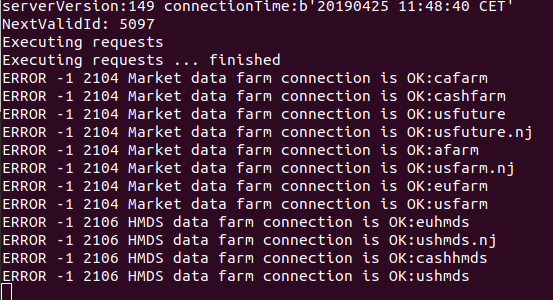
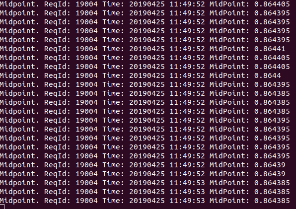

# Python and the LYNX API

*A simple Python implementation for requesting streaming Market Data from Trader Workstation or the LYNX Gateway*

## Requirements:

> - [API Software](https://lynxbroker.github.io/#/API_versions) Installed
>- TWS Running
> - Socket Connection enabled and configured: *Configure->API->Settings* *(Port - 7496 & Enable ActiveX and Socket Clients)*
> - Python 3.6 or higher
> - Set-up your environment to work with the API as described [here](/articles/Python/README.md)
> 


At the bottom you will find the full example to request Market Data using the LYNX API, or download the .py file directly [here](/request_market_data.py). 

## Initial Setup

**EWrapper and EClient:**

```python
# Copyright (C) 2019 LYNX B.V. All rights reserved.

# Import api dependencies
from ibapi import wrapper
from ibapi.client import EClient
from ibapi.utils import iswrapper
from ibapi.contract import *
import datetime

class Wrapper(wrapper.EWrapper):
    def __init__(self):
        wrapper.EWrapper.__init__(self)

class Client(EClient):
    def __init__(self, wrapper):
        EClient.__init__(self, wrapper)

class App(Wrapper, Client):
    def __init__(self):
        Wrapper.__init__(self)
        Client.__init__(self, wrapper=self)
        self.started = False
```

> Once our two main objects have been created, EWrapper and ESocketClient, the client application can connect via the EClientSocket object which we do later, in the main function. 

**The Main function:**

```python
def main():
    try:
        # Init the App(Wrapper, Client)
        app = App()
        # Connect via the EClientSocket object to TWS via socket port 7496
        app.connect("127.0.0.1", 7496, clientId=0)
        
        print("serverVersion:%s connectionTime:%s" % (app.serverVersion(),
                                                      app.twsConnectionTime()))
        app.run()
        
    except:
        raise
```

> Once the client is connected, a reader thread will be automatically created to handle incoming messages and put the messages into a message queue for further process. It is required to trigger Client::run() above, where the message queue is processed in an infinite loop and the EWrapper call-back functions are automatically triggered.

---

## Receiving Real-Time, Streaming, Quotes from the LYNX API:

In order to start receiving data we need to perform three actions:

1. Define the contract to request
2. Define the actual request
3. Print the return from the request

**The contract definition:**

```python
# Define the contract to request
contract = Contract()
contract.symbol = "EUR"
contract.secType = "CASH" # STK, FUT & OPT are other Security Types available
contract.currency = "GBP"
contract.exchange = "IDEALPRO"
```

**The Request**:

```python
# Here we are requesting tickdata for the EUR.GBP Contract. The contract's specification is defined above
self.reqTickByTickData(19004, contract, "MidPoint", 0, False)
```

**Returning the Request:**

```python
# Here we print the Midpoint, Request ID and Time returned from the request
@iswrapper
def tickByTickMidPoint(self, reqId: int, time: int, midPoint: float):
        super().tickByTickMidPoint(reqId, time, midPoint)
        print("Midpoint. ReqId:", reqId,
              "Time:", datetime.datetime.fromtimestamp(time).strftime("%Y%m%d %H:%M:%S"),
              "MidPoint:", midPoint)   
```


---

### The entire code:


```python
# Copyright (C) 2019 LYNX B.V. All rights reserved.

# Import api dependencies
from ibapi import wrapper
from ibapi.client import EClient
from ibapi.utils import iswrapper
from ibapi.contract import *
import datetime

class Wrapper(wrapper.EWrapper):
    def __init__(self):
        wrapper.EWrapper.__init__(self)

class Client(EClient):
    def __init__(self, wrapper):
        EClient.__init__(self, wrapper)

class App(Wrapper, Client):
    def __init__(self):
        Wrapper.__init__(self)
        Client.__init__(self, wrapper=self)
        self.started = False
        
    @iswrapper
    def nextValidId(self, orderId: int):
        super().nextValidId(orderId)
        self.nextValidOrderId = orderId
        print("NextValidId:", orderId)
    
        # We can start now
        self.start()
 
    @iswrapper
    def start(self):
        if self.started:
            return

        self.started = True
        print("Executing requests")

        # Define the contract to request
        contract = Contract()
        contract.symbol = "EUR"
        contract.secType = "CASH" # STK, FUT & OPT are other Security Types available
        contract.currency = "GBP"
        contract.exchange = "IDEALPRO"

        # Here we are requesting tickdata for the EUR.GBP Contract. The contract's specification is defined above
        self.reqTickByTickData(19004, contract, "MidPoint", 0, False)
            
        print("Executing requests ... finished")

    # Here we print the Midpoint, Request ID and Time returned from the request
    @iswrapper
    def tickByTickMidPoint(self, reqId: int, time: int, midPoint: float):
        super().tickByTickMidPoint(reqId, time, midPoint)
        print("Midpoint. ReqId:", reqId,
              "Time:", datetime.datetime.fromtimestamp(time).strftime("%Y%m%d %H:%M:%S"),
              "MidPoint:", midPoint)     
        
def main():
    try:
        # Init the App(Wrapper, Client)
        app = App()
        # Connect via the EClientSocket object to TWS via socket port 7496
        app.connect("127.0.0.1", 7496, clientId=0)
        
        print("serverVersion:%s connectionTime:%s" % (app.serverVersion(),
                                                      app.twsConnectionTime()))
        app.run()
        
    except:
        raise
        
if __name__ == "__main__":
    main()


```


## More information:

**Running the program:**


> After installing the necessary files you should be able to run *request_market_data.py* from you IDE or from your terminal using:

```bash
python3 request_market_data.py
```


> After which the following response indicates a successful connection:




> After which a stream of data should start generating:



---

### More resources:

Take a further look at our online API Documentation to discover all of the possibilities using LYNX' API.

- [LYNX Basic Contract Definitions](https://lynxbroker.github.io/#/BasicContracts.md)
- [LYNX Requesting Market Data](https://lynxbroker.github.io/#/TopMarketData.md)
- [LYNX Available TickTypes](https://lynxbroker.github.io/#/TickTypes.md)


<a href="https://lynx.nl"></a>