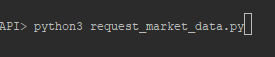
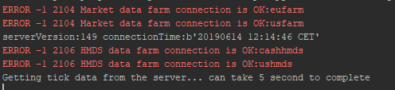

# Python and the LYNX API

*A simple Python implementation for requesting streaming Market Data from Trader Workstation or the LYNX Gateway*

## Requirements:

> - [API Software](https://api.lynx.academy/API_versions) Installed
>- TWS Running
> - Socket Connection enabled and configured: *Configure->API->Settings* *(Port - 7496 & Enable ActiveX and Socket Clients)*
> - Python 3.6 or higher
> - Set-up your environment to work with the API as described [here](/Python/README.md)
> 


At the bottom you will find the full example to request Market Data using the LYNX API, or download the .py file directly [here](https://raw.githubusercontent.com/lynxbroker/API-examples/master/Python/request_market_data/request_market_data.py). 

## Initial Setup

**EWrapper and EClient:**

```python
# Copyright (C) 2019 LYNX B.V. All rights reserved.

# Import api dependencies
from ibapi import wrapper
from ibapi.client import EClient
from ibapi.contract import *
from threading import Thread

from datetime import datetime
from time import sleep

class Wrapper(wrapper.EWrapper):
    def __init__(self):
        wrapper.EWrapper.__init__(self)

class Client(EClient):
    def __init__(self, wrapper):
        EClient.__init__(self, wrapper)
        
class TestApp(Wrapper, Client):
    def __init__(self, ipaddress, portid, clientid):
        Wrapper.__init__(self)
        Client.__init__(self, wrapper=self)

        self.connect(ipaddress, portid, clientid)

        thread = Thread(target=self.run)
        thread.start()

        setattr(self, "_thread", thread)

```

> Once TWS is actively listening for an incoming connection, the two main objects (EWrapper and ESocketClient) can be created. The EWrapper is necessary to receive and handle the information coming from the TWS and The ESocketCLient is used to send request/messages to the TWS. Placing them together in de TestApp class and adding a thread starts a process to listen for incoming messages and insert them in the Ewrapper. 

---

## Receiving Real-Time, Streaming, Quotes from the LYNX API:

In order to start receiving data we need to perform four actions:

1. Define the contract to request
2. Define the actual request
3. Print the return from the request
4. Call the function that includes the request in the main

**The contract definition:**

```python
# Define the contract
contract = Contract()
contract.symbol = "EUR"
contract.secType = "CASH"
contract.currency = "USD"
contract.exchange = "IDEALPRO"
```

**The Request**:

```python
# Here we are requesting tickdata for the EUR.USD Contract. The request is inserted in a function placed in the EClient class. 
self.reqTickByTickData(reqId, contract, "MidPoint", 0, False)
```

**Returning the Request:**

```python
# Here we print the Midpoint, Request ID and Time returned by the Ewrapper from the request
def tickByTickMidPoint(self, reqId: int, time: int, midPoint: float):
        print("Midpoint. ReqId:", reqId,
              "Time:", datetime.datetime.fromtimestamp(time).strftime("%Y%m%d %H:%M:%S"),
              "MidPoint:", midPoint)   
```

**The main function:**

```python
# Init the TestApp(Wrapper, Client)
app = TestApp("localhost", 7496, clientid = 0)
print("serverVersion:%s connectionTime:%s" % (app.serverVersion(),
                                              app.twsConnectionTime()))
# Here we call the function that includes the request for market data                                              
app.get_marketData(contract)
```
                                             
---

### The entire code:


```python

# Copyright (C) 2019 LYNX B.V. All rights reserved.


# Import ibapi deps
from ibapi import wrapper
from ibapi.client import EClient
from ibapi.contract import *
from threading import Thread

from datetime import datetime
from time import sleep

MARKET_ID = 19004

class Wrapper(wrapper.EWrapper):
    def __init__(self):
        wrapper.EWrapper.__init__(self)

    def tickByTickMidPoint(self, reqId: int, time: int, midPoint: float):
        """returns tick-by-tick data for tickType = "MidPoint" """

        print("Midpoint. ReqId:", reqId,
              "Time:", datetime.fromtimestamp(time).strftime("%Y%m%d %H:%M:%S"),
              "MidPoint:", midPoint)

class Client(EClient):
    def __init__(self, wrapper):
        EClient.__init__(self, wrapper)

    def get_marketData(self, contract, reqId = MARKET_ID):

        # Here we are requesting tickdata for the EUR.GBP Contract.
        self.reqTickByTickData(reqId, contract, "MidPoint", 0, False)

        MAX_WAITED_SECONDS = 5
        print("Getting tick data from the server... can take %d second to complete" % MAX_WAITED_SECONDS)

        sleep(MAX_WAITED_SECONDS)

class TestApp(Wrapper, Client):
    def __init__(self, ipaddress, portid, clientid):
        Wrapper.__init__(self)
        Client.__init__(self, wrapper=self)

        self.connect(ipaddress, portid, clientid)

        thread = Thread(target=self.run)
        thread.start()

        setattr(self, "_thread", thread)

def main():
    # Init the TestApp(Wrapper, Client)
    app = TestApp("localhost", 7496, clientid = 0)
    print("serverVersion:%s connectionTime:%s" % (app.serverVersion(),
                                                  app.twsConnectionTime()))

    # Define the contract
    contract = Contract()
    contract.symbol = "EUR"
    contract.secType = "CASH"
    contract.currency = "USD"
    contract.exchange = "IDEALPRO"
    
    # Here we call the function that includes the request for market data   
    app.get_marketData(contract)

if __name__ == "__main__":
    main()
```


## More information:

**Running the program:**


> After installing the necessary files you should be able to run *request_market_data.py* from you IDE or from your terminal using:

```bash
python3 request_market_data.py
```



> After which the following response indicates a successful connection:




> After which a stream of data should start generating:


---

### More resources:

Take a further look at our online API Documentation to discover all of the possibilities using LYNX' API.

- [LYNX Basic Contract Definitions](https://api.lynx.academy/BasicContracts.md)
- [LYNX Requesting Market Data](https://api.lynx.academy/TopMarketData.md)
- [LYNX Available TickTypes](https://api.lynx.academy/TickTypes.md)
<br/>

<p align="center">
  
</p>
