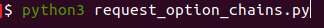
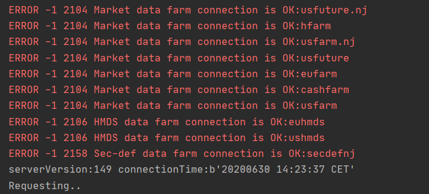
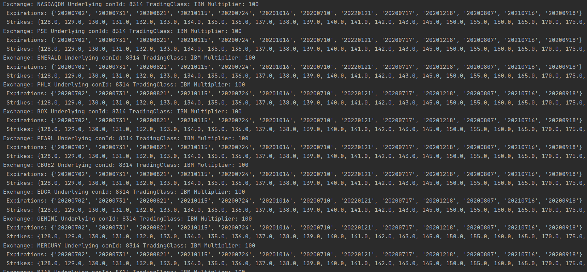

# Python and the LYNX API

*A simple Python implementation for requesting Option Chains from Trader Workstation or the LYNX Gateway*

Option Chains consist of all the possible strike & expiry combinations of option contracts for an underlying.

## Requirements:

> - [API Software](https://api.lynx.academy/API_versions) Installed
>- TWS Running
> - Socket Connection enabled and configured: *Configure->API->Settings* *(Port - 7496 & Enable ActiveX and Socket Clients)*
> - Python 3.6 or higher
> - Set-up your environment to work with the API as described [here](/Python/SETUP.md)
> 


At the bottom you will find the full example to request Option Chains using the LYNX API, or download the .py file directly [here](/Python/request_option_chains/request_option_chains.py). 

## Initial Setup

**EWrapper and EClient:**

```python
# Copyright (C) 2020 LYNX B.V. All rights reserved.

# Import api dependencies
from ibapi import wrapper
from ibapi.client import EClient
from ibapi.contract import *
from threading import Thread

from datetime import datetime
from time import sleep

class Wrapper(wrapper.EWrapper):
    def __init__(self):
        wrapper.EWrapper.__init__(self)

class Client(EClient):
    def __init__(self, wrapper):
        EClient.__init__(self, wrapper)

class App(Wrapper, Client):
    def __init__(self, ipaddress, portid, clientid):
        Wrapper.__init__(self)
        Client.__init__(self, wrapper=self)
        self.connect(ipaddress, portid, clientid)   
        thread = Thread(target = self.run)
        thread.start()
        setattr(self, "_thread", thread)

```

> Once TWS is actively listening for an incoming connection, the two main objects (EWrapper and ESocketClient) can be created. The EWrapper is necessary to receive and handle the information coming from the TWS and The ESocketCLient is used to send request/messages to the TWS. Placing them together in de TestApp class and adding a thread starts a process to listen for incoming messages and insert them in the Ewrapper. 

---

## Receiving Option Chains from the LYNX API:

In order to start receiving data we need to perform three actions:

1. Define the request > Option Chain data
2. Call the function that includes the request from the main function
3. Handle the response > in this example we simply print the response


**The Request**:

```python
# Here we are requesting the option chain data for IBM. IBM is the ticker, STK is the security type and 8314 is IBM's contract ID 
self.reqSecDefOptParams(0, contract.symbol, "", contract.secType, 8314)

> reqSecDefOptParams returns a list of expiries and a list of strike prices. In some cases it is possible there are combinations of strike and expiry that    would not give a valid option contract.

More information about Option Chains [here](https://api.lynx.academy/Options?id=option-chains)
```

**The main function:**

```python
app = App('localhost', 7496, 0)
    app.requestOptionChains()
```

**Handling the response:**

```python
# Here we print the response returned by the Ewrapper from the request
def securityDefinitionOptionParameter(self, reqId: int, exchange: str,
        underlyingConId: int, tradingClass: str, multiplier: str,
        expirations: SetOfString, strikes: SetOfFloat):

        super().securityDefinitionOptionParameter(reqId, exchange,
        underlyingConId, tradingClass, multiplier, expirations, strikes)
        print("SecurityDefinitionOptionParameter.",
        "ReqId:", reqId, "Exchange:", exchange, "Underlying conId:", underlyingConId, "TradingClass:", tradingClass, "Multiplier:", multiplier,
        "Expirations:", expirations, "Strikes:", str(strikes))
```

---

### The entire code:


```python

# Copyright (C) 2020 LYNX B.V. All rights reserved.
from ibapi import wrapper
from ibapi.wrapper import EWrapper
from ibapi.client import EClient

# We require common and contract to handle the incoming data
from ibapi.common import *
from ibapi.contract import *

# We require threading to handle the data streams
from threading import Thread

# Client => this is where our requests are made
class Client(EClient):
    def __init__(self, wrapper):
        EClient.__init__(self, wrapper)

    def requestOptionChains(self, contract):
        print("Requesting..")
        self.reqSecDefOptParams(0, contract.symbol, "", contract.secType, 8314)

class Wrapper(EWrapper):
    def __init__(self):
        wrapper.EWrapper.__init__(self)

    def securityDefinitionOptionParameter(self, reqId: int, exchange: str,
        underlyingConId: int, tradingClass: str, multiplier: str,
        expirations: SetOfString, strikes: SetOfFloat):
        """ Returns the option chain for an underlying on an exchange
        specified in reqSecDefOptParams There will be multiple callbacks to
        securityDefinitionOptionParameter if multiple exchanges are specified
        in reqSecDefOptParams

        reqId - ID of the request initiating the callback
        underlyingConId - The conID of the underlying security
        tradingClass -  the option trading class
        multiplier -    the option multiplier
        expirations - a list of the expiries for the options of this underlying
             on this exchange
        strikes - a list of the possible strikes for options of this underlying
             on this exchange """

        super().securityDefinitionOptionParameter(reqId, exchange,
        underlyingConId, tradingClass, multiplier, expirations, strikes)
        print("Exchange:", exchange, "Underlying conId:", underlyingConId, "TradingClass:", tradingClass, "Multiplier:", multiplier,'\n',
        "Expirations:", expirations,'\n', "Strikes:", str(strikes))

# App
class App(Wrapper, Client):
    def __init__(self, ipaddress, portid, clientid):
        Wrapper.__init__(self)
        Client.__init__(self, wrapper=self)
        self.connect(ipaddress, portid, clientid)
        thread = Thread(target = self.run)
        thread.start()
        setattr(self, "_thread", thread)

def main():
    app = App('localhost', 7496, 0)
    print("serverVersion:%s connectionTime:%s" % (app.serverVersion(),
                                                  app.twsConnectionTime()))

    # Define the contract
    contract = Contract()
    contract.symbol = "IBM"
    contract.secType = "STK"
    contract.currency = "USD"
    contract.exchange = "SMART"

    app.requestOptionChains(contract)

if __name__ == "__main__":
    main()
```


## More information:

**Running the program:**


> After installing the necessary files you should be able to run *request_option_chains.py* from you IDE or from your terminal using:

```bash
python3 request_option_chains.py
```



> After which the following response indicates a successful connection:




> After which a stream of data should start generating:



---

### More resources:

Take a further look at our online API Documentation to discover all of the possibilities using LYNX' API.

- [LYNX Basic Contract Definitions](https://api.lynx.academy/BasicContracts)
- [LYNX Options](https://api.lynx.academy/Options)
- [LYNX Available TickTypes](https://api.lynx.academy/TickTypes)
<br/>

<p align="center">
  
</p>
